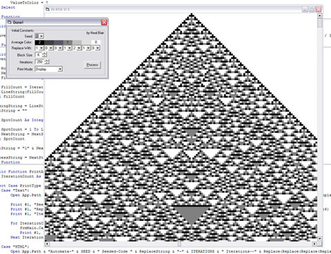



## Totalistic Cellular Automaton Generator

### Description

The purpose of this program is to generate highly-complex cellular automata from a simple set of user inputs. This is accomplished by analyzing a string of color blocks and generating the next line based upon the average of every block with its neighbors. This average is then changed back to a fundamental color by the rules given by the user.

Please don't forget to post comments/suggests and vote. Thanks for checking out my code.

Something I discovered after posting here... this is for those people who find mathematics interesting... if you run the program with a seed of '1' and a replacement string of '1001120' you'll generate a perfect Fibinaci Triangle. Give it a try... if you set the blocksize low, turn up the iterations, and set the print mode for 'Display' you'll get a very impressive-looking image. Be careful, though, not to generate anything too complex that your computer cannot handle it.
 
### More Info
 
I wrote this code after becoming interested in Stephen Wolfram's work on cellular automata, particularly his research in "A New Kind of Science." This code is being developed as a means of exploration into Wolfram's research.

I also decided to begin this project to experiment with graphical programming with BitBlt()--something I had never done.

None that I know of. A sort-of side effect would be the almost unlimited image complexity possible. An automaton generated with too many iterations and too high a detail could hang the computer for quite a while.

             |
---                |---
**Submitted On**   |2002-08-23 14:09:28
**By**             |[Neal Blair](https://github.com/Planet-Source-Code/PSCIndex/blob/master/ByAuthor/neal-blair.md)
**Level**          |Intermediate
**User Rating**    |5.0 (15 globes from 3 users)
**Compatibility**  |VB 5\.0, VB 6\.0
**Category**       |[Complete Applications](https://github.com/Planet-Source-Code/PSCIndex/blob/master/ByCategory/complete-applications__1-27.md)
**World**          |[Visual Basic](https://github.com/Planet-Source-Code/PSCIndex/blob/master/ByWorld/visual-basic.md)
**Archive File**   |[Totalistic1217208232002\.zip](https://github.com/Planet-Source-Code/neal-blair-totalistic-cellular-automaton-generator__1-38223/archive/master.zip)

### API Declarations

Included in a module.

